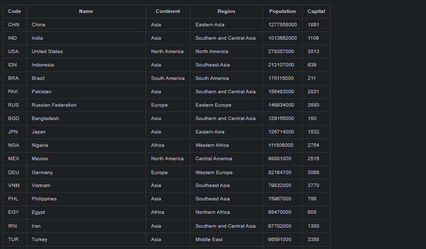

Workflow: 

Licence: 

Release: 

Master: 
Develop: 

| ID | Name                                                                                                  | MET | Screenshot                                   |
|----|-------------------------------------------------------------------------------------------------------|-----|:---------------------------------------------|
| 1  | All the countries in the world organised by largest population to smallest.                           | YES |                                              |
| 2  | All the countries in a continent organised by largest population to smallest.                         | YES |                                              |
| 3  | All the countries in a region organised by largest population to smallest.                            | YES |                                              |
| 4  | The top N populated countries in the world where N is provided by the user.                           | YES |                                              |
| 5  | The top N populated countries in a continent where N is provided by the user.                         | YES |                                              |
| 6  | The top N populated countries in a region where N is provided by the user.                            | YES |                                              |
| 7  | All the cities in the world organised by largest population to smallest.                              | YES |                                              |
| 8  | All the cities in a continent organised by largest population to smallest.                            | YES |                                              |
| 9  | All the cities in a region organised by largest population to smallest.                               | YES |                                              |
| 10 | All the cities in a country organised by largest population to smallest.                              | YES |                                              |
| 11 | All the cities in a district organised by largest population to smallest.                             | YES |                                              |
| 12 | The top N populated cities in the world where N is provided by the user.                              | YES |                                              |
| 13 | The top N populated cities in a continent where N is provided by the user.                            | YES |                                              |
| 14 | The top N populated cities in a region where N is provided by the user.                               | YES |                                              |
| 15 | The top N populated cities in a country where N is provided by the user.                              | YES |                                              |
| 16 | The top N populated cities in a district where N is provided by the user.                             | YES |                                              |
| 17 | All the capital cities in the world organised by largest population to smallest.                      | YES |           |
| 18 | All the capital cities in a continent organised by largest population to smallest.                    | YES |           |
| 19 | All the capital cities in a region organised by largest to smallest.                                  | YES |                                              |
| 20 | The top N populated capital cities in the world where N is provided by the user.                      | YES |                                              |
| 21 | The top N populated capital cities in a continent where N is provided by the user.                    | YES |                                              |
| 22 | The top N populated capital cities in a region where N is provided by the user.                       | YES |                                              |
| 23 | The population of people, people living in cities, and people not living in cities in each continent. | YES |                                              |
| 24 | The population of people, people living in cities, and people not living in cities in each region.    | YES |                                              |
| 25 | The population of people, people living in cities, and people not living in cities in each country.   | YES |                                              |
| 26 | The population of the world.                                                                          | YES |                                              |
| 27 | The population of a continent.                                                                        | YES |                                              |
| 28 | The population of a region.                                                                           | YES |                                              |
| 29 | The population of a country.                                                                          | YES |                                              |
| 30 | The population of a district.                                                                         | YES |                                              |
| 31 | The population of a city.                                                                             | YES |                                              |
| 32 | Sort Language                                                                                         | NO  |                                              |