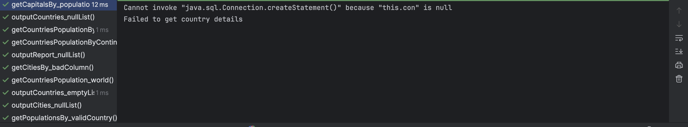

Workflow: 

Licence: 

Release: 

Master: 
Develop: 

| ID    | Name | MET | Screenshot |
|-------|------|-----|:-----------|
| 1     | All the countries in the world organised by largest population to smallest. | YES |            |
| 2     | All the countries in a continent organised by largest population to smallest. | YES |            |
| 3     | All the countries in a region organised by largest population to smallest. | NO  |            |
| 4     | The top N populated countries in the world where N is provided by the user. | NO  |            |
| 5     | The top N populated countries in a continent where N is provided by the user. | NO  |            |
| 6     | The top N populated countries in a region where N is provided by the user. | NO  |            |
| 7     | All the cities in the world organised by largest population to smallest. | NO  |            |
| 9     | All the cities in a region organised by largest population to smallest. | NO  |            |
| 10    | All the cities in a country organised by largest population to smallest. | NO  |            |
| 11    | All the cities in a district organised by largest population to smallest. | NO  |            |
| 12    | The top N populated cities in the world where N is provided by the user. | NO  |            |
| 13    | The top N populated cities in a continent where N is provided by the user. | NO  |            |
| 14    | The top N populated cities in a region where N is provided by the user. | NO  |            |
| 15    | The top N populated cities in a country where N is provided by the user. | NO  |            |
| 16    | The top N populated cities in a district where N is provided by the user. | NO  |            |
| 17    | All the capital cities in the world organised by largest population to smallest. | YES |  |
| 18    | All the capital cities in a continent organised by largest population to smallest. | YES |  |
| 19    | All the capital cities in a region organised by largest to smallest. | YES |  |
| 20    | The top N populated capital cities in the world where N is provided by the user. | YES |  |
| 21    | The top N populated capital cities in a continent where N is provided by the user. | YES |  |
| 22    | The top N populated capital cities in a region where N is provided by the user. | YES |  |
| 23    | The population of people, people living in cities, and people not living in cities in each continent. | YES |  |
| 24    | The population of people, people living in cities, and people not living in cities in each region. | YES |  |
| 25    | The population of people, people living in cities, and people not living in cities in each country. | YES |  |

| 26    | The population of the world. | NO  |            |
| 27    | The population of a continent. | NO  |            |
| 28    | The population of a region. | NO  |            |
| 29    | The population of a country. | NO  |            |
| 30    | The population of a district. | NO  |            |
| 31    | The population of a city. | NO  |            |
| 32    | Sort Language | NO  |            |
